# AWS Serverless Architecture: Cost & Performance Trade-Off Analysis

> An evidence-driven AWS serverless project that evaluates Lambda memory settings with CloudFormation, AWS Lambda Power Tuning, and Postman load tests.

This hands-on portfolio project applies the AWS Well-Architected **Cost Optimization** pillar to an API Gateway → Lambda → DynamoDB workload. Instead of guessing memory sizes, this project uses empirical, measured evidence to identify the ideal balance between a cost-optimized and a performance-optimized Lambda configuration.

---

### 📊 Key Results

| Metrics | 128 MB (Baseline) | 512 MB (Cost-Optimized) | 1024 MB (Performance) |
| :--- | :--- | :--- | :--- |
| **Avg. Response Time** | 231 ms | **119 ms** (48.5% lower latency) | **67 ms** (71.0% lower latency) |
| **Error Rate** | 0.00% | 0.00% | 0.00% |
| **Lambda Compute Cost** | Highest | **Lowest direct-Lambda cost** | Slightly higher |

* **The Takeaway:** **512 MB** was selected by Lambda Power Tuning as the lowest-cost configuration while achieving a responsive 119 ms average API response time. **1024 MB** delivered the lowest latency (67 ms) but increased estimated Lambda invocation cost.

> ⚠️ *Note: These results apply to this specific application code, payload size, AWS region, and test conditions. Re-run measurements after any material workload or architectural changes.*

## 📑 Table of contents

- [Getting started](#getting-started)
- [Architecture](#architecture)
- [CloudFormation provisions](#cloudformation-provisions)
- [Implementation walkthrough](#implementation-walkthrough)
  - [Deploy the automated foundation](#1-deploy-the-automated-foundation)
  - [Create and deploy the Lambda function](#2-create-and-deploy-the-lambda-function)
  - [Create and deploy API Gateway](#3-create-and-deploy-api-gateway)
  - [Test the API with Postman and DynamoDB](#4-test-the-api-and-invoke-it-via-postman-to-create-and-retrieve-two-dynamodb-items)
- [Lambda Power Tuning baseline](#lambda-power-tuning-baseline)
- [End-to-end Postman load tests](#postman-load-tests)
- [Recommendation](#recommendation)
- [Cost-optimization practices demonstrated](#cost-optimization-practices)
- [References](#references)

<a id="getting-started"></a>
## 🚀 Getting started

### Prerequisites

- An AWS account and permissions to create the resources in this project, including a named IAM role through CloudFormation.
- AWS CLI v2 configured for the target AWS Region, or access to the AWS Management Console.
- Postman to run the functional and performance tests.

### Quick start

1. Deploy [`infrastructure/foundation.yaml`](infrastructure/foundation.yaml) using the CLI or console procedure in [Step 1](#1-deploy-the-automated-foundation).
2. Create the Lambda function with the CloudFormation-provisioned `lambda-apigateway-role`, then configure the API Gateway `POST` integration as described in [Steps 2–3](#2-create-and-deploy-the-lambda-function).
3. Validate the request path in Postman, run the Power Tuning baseline, and compare the end-to-end load-test results.

<a id="architecture"></a>
## 🏗️ Architecture

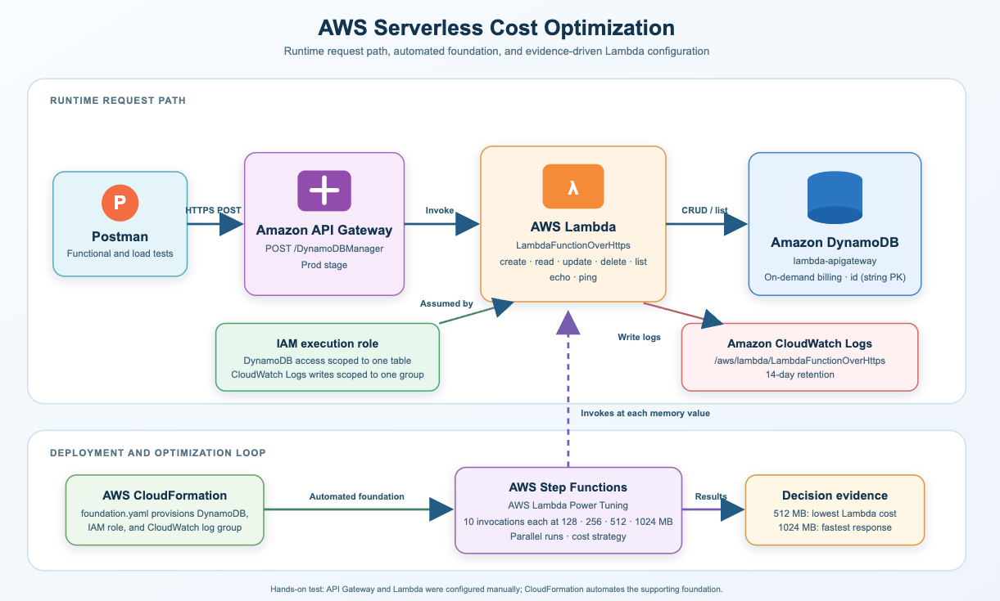

The Lambda application code supports `create`, `read`, `update`, `delete`, `list`, `echo`, and `ping` operations against DynamoDB. My enhancement is the automated foundation and the evidence-driven cost/performance analysis.

<a id="cloudformation-provisions"></a>
## ☁️ What CloudFormation provisions

[`infrastructure/foundation.yaml`](infrastructure/foundation.yaml) creates the supporting resources. API Gateway and Lambda are configured manually for this hands-on test.

| Component | Configuration |
| --- | --- |
| DynamoDB | `lambda-apigateway` table with on-demand billing and a string `id` partition key |
| IAM execution role | `lambda-apigateway-role`, limited to required DynamoDB actions and CloudWatch Logs writes |
| CloudWatch Logs | `/aws/lambda/LambdaFunctionOverHttps` with 14-day retention |

Access is scoped to this table and log group, without wildcard permissions. The template also provides the resource names and ARNs as CloudFormation outputs.

<a id="implementation-walkthrough"></a>
## 🛠️ Implementation walkthrough

### 1. Deploy the automated foundation

Choose either deployment option below. The command assumes the AWS CLI is configured and is run from the repository root.

**Option A — AWS CLI**

```bash
aws cloudformation create-stack \
  --stack-name serverless-cost-optimization-foundation-stack \
  --template-body file://infrastructure/foundation.yaml \
  --capabilities CAPABILITY_NAMED_IAM
```

Wait for the stack to finish before creating the Lambda function:

```bash
aws cloudformation wait stack-create-complete \
  --stack-name serverless-cost-optimization-foundation-stack
```

**Option B — AWS Management Console**

1. Open **CloudFormation** → **Create stack** → **With new resources (standard)**.
2. Select **Template is ready** → **Upload a template file**, then upload [`foundation.yaml`](infrastructure/foundation.yaml).
3. Enter `serverless-cost-optimization-foundation-stack` as the stack name and keep the parameter defaults unless the project needs different names or tags.
4. Acknowledge **CAPABILITY_NAMED_IAM** and submit the stack.
5. After the stack reaches `CREATE_COMPLETE`, open **Outputs** and use `LambdaExecutionRoleName` when creating the Lambda function.

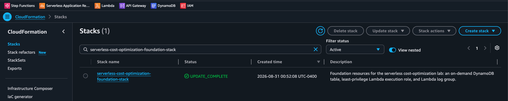

The resource inventory confirms that the stack created the DynamoDB table, Lambda execution role, and CloudWatch log group.

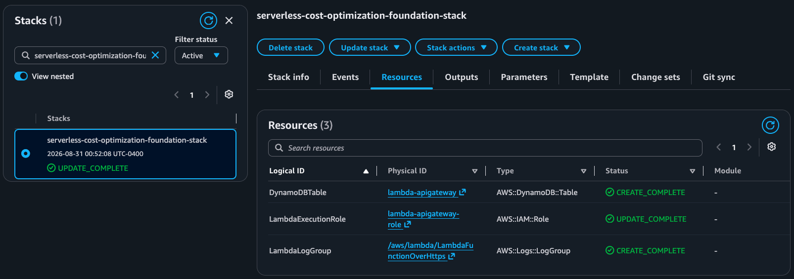

This screenshot confirms that CloudFormation provisioned the `lambda-apigateway` table. In [`foundation.yaml`](infrastructure/foundation.yaml), `id` is configured as the string partition key and billing is configured as on-demand.


The named `lambda-apigateway-role` contains only the two inline policies created by the template: table access and function logging.


### 2. Create and deploy the Lambda function

Create `LambdaFunctionOverHttps` with the CloudFormation-provisioned execution role, then deploy the function code used for this hands-on test.

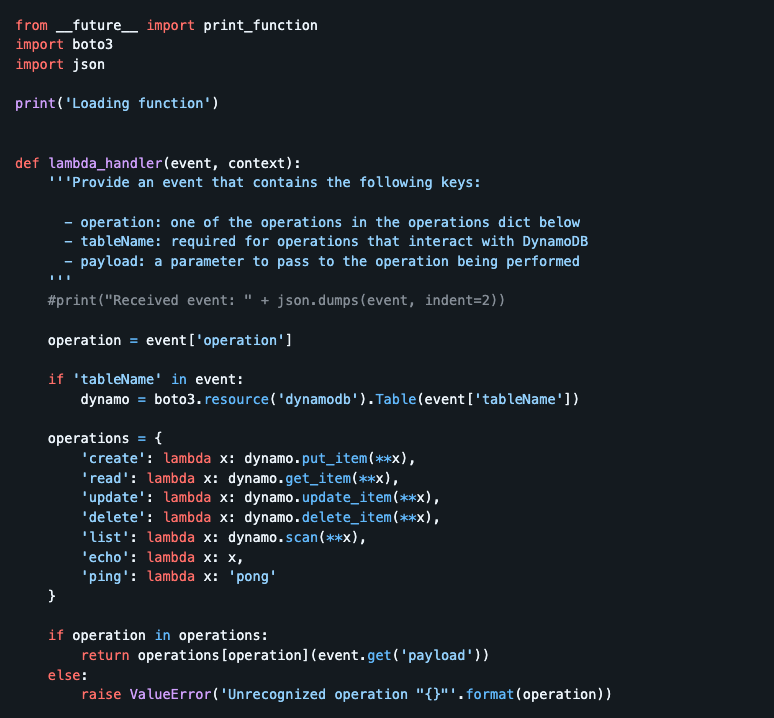

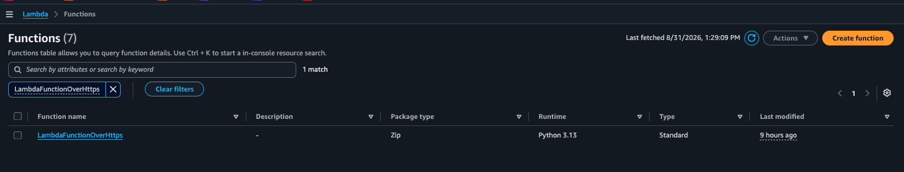

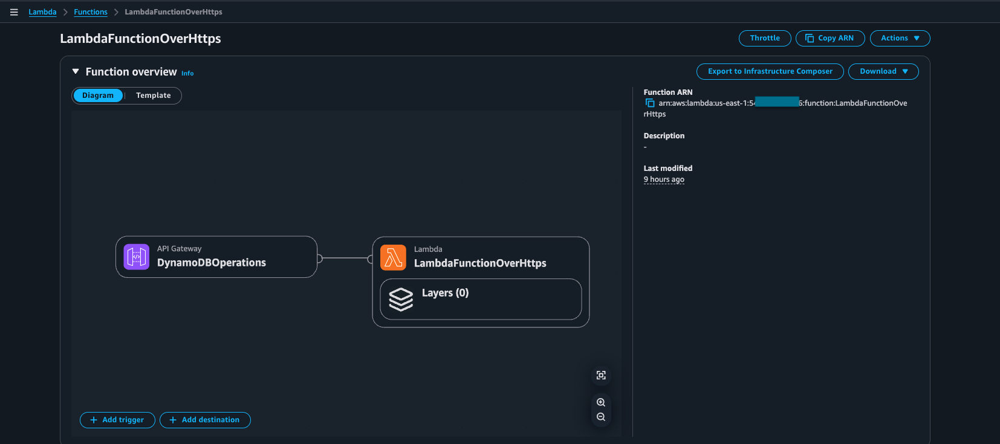


### 3. Create and deploy API Gateway

Create the API Gateway resource `/DynamoDBManager`, configure its `POST` method to invoke the Lambda function, then deploy the API to the `Prod` stage. The API invoke URL is redacted in the evidence.

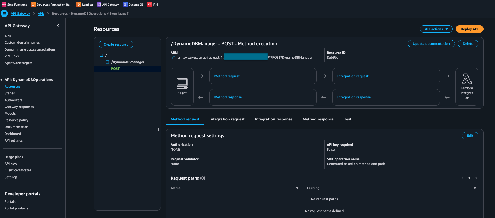


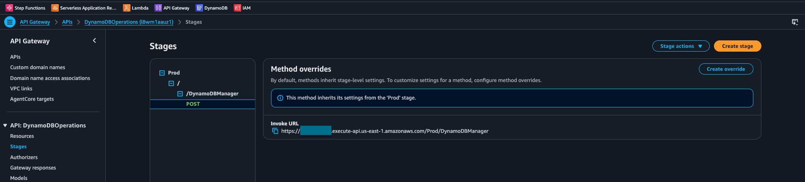

### 4. Test the API and invoke it via Postman to create and retrieve two DynamoDB items

First, an `echo` event validates that the Lambda function executes successfully.

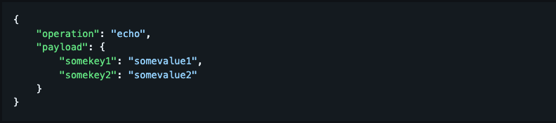

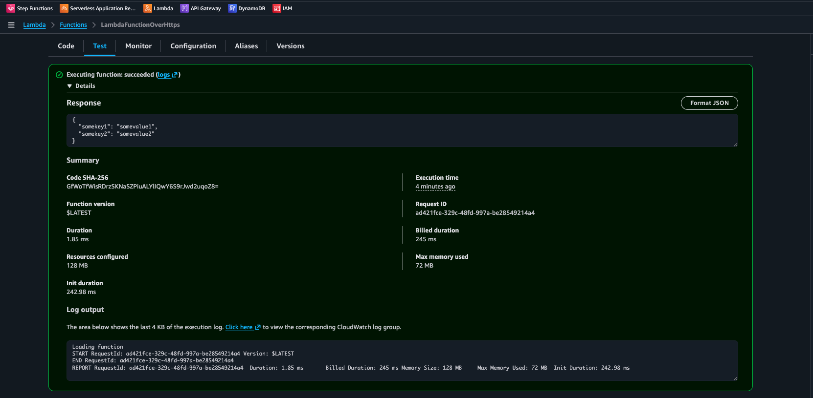

Next, Postman invokes the API to create two DynamoDB records and retrieve them through the Lambda `list` operation. This confirms the deployed API Gateway → Lambda → DynamoDB path before collecting performance data.

```json
{
  "operation": "create",
  "tableName": "lambda-apigateway",
  "payload": {
    "Item": {
      "id": "cost-opt-demo-001",
      "project": "aws-serverless-cost-optimization",
      "workload": "api-gateway-lambda-dynamodb",
      "testPhase": "functional-validation",
      "memoryMb": 128,
      "status": "created"
    }
  }
}
```

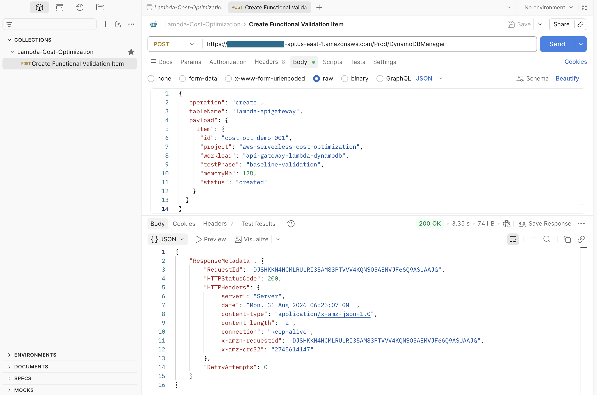

The `list` operation retrieves the items through API Gateway and confirms the Lambda can read the records it created.

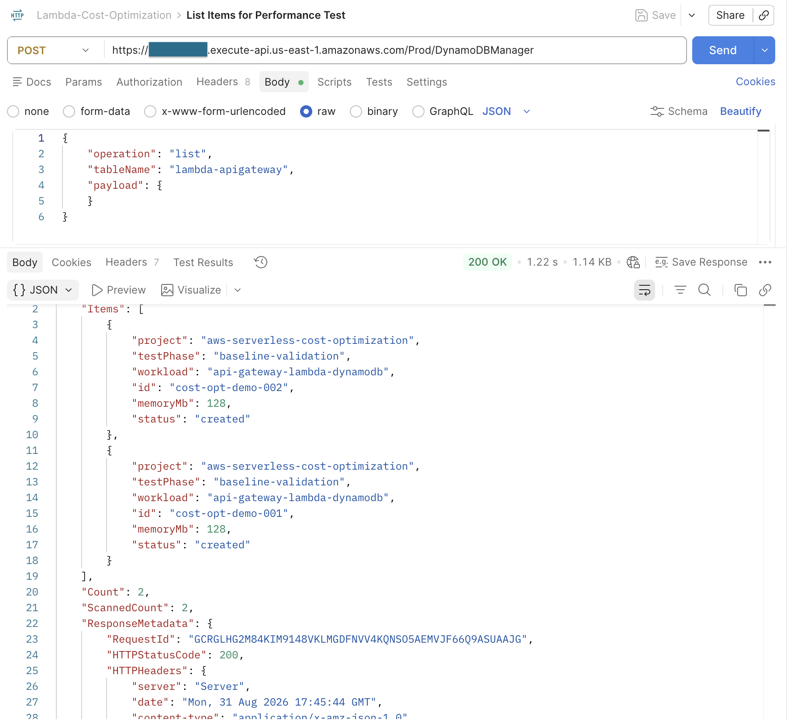

The DynamoDB console provides an independent view of the items persisted in the table.

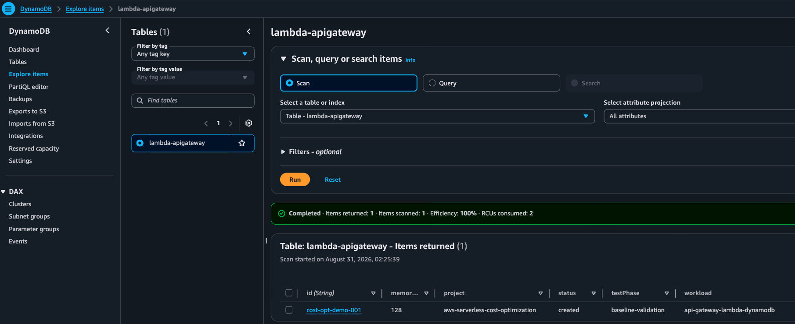

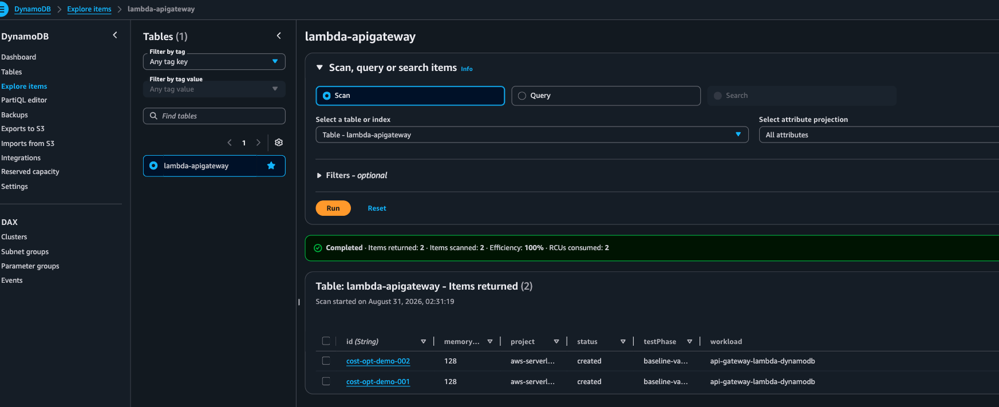

<a id="lambda-power-tuning-baseline"></a>
## ⚡ Baseline: AWS Lambda Power Tuning

AWS Lambda Power Tuning is a Step Functions-based tool that invokes the same Lambda at multiple memory settings and compares its average duration and estimated Lambda invocation cost. This baseline is a **direct Lambda measurement**; it does not include API Gateway latency.

The following setup deploys the `aws-lambda-power-tuning` application from the Serverless Application Repository and verifies the generated Step Functions state machine.

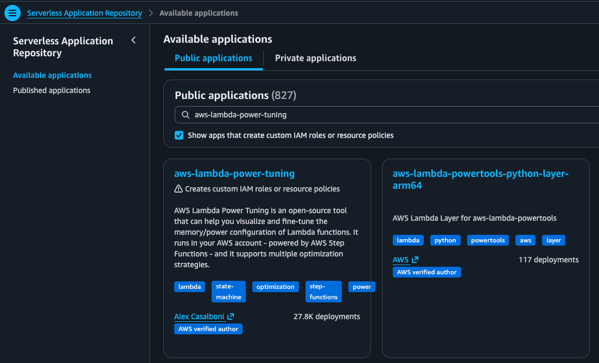

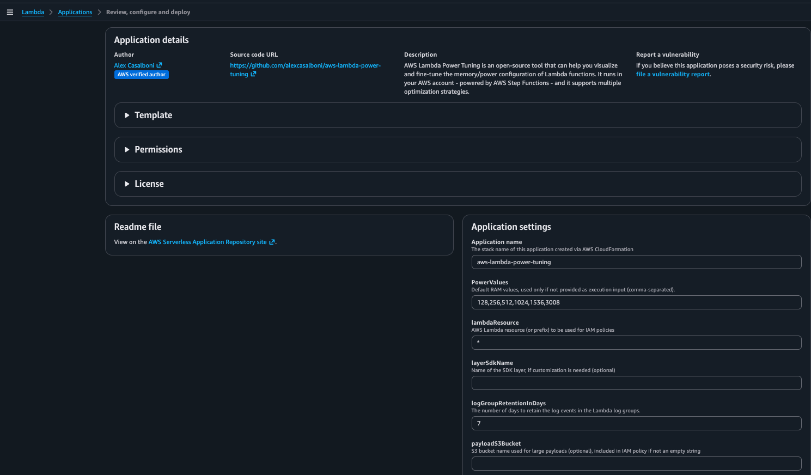

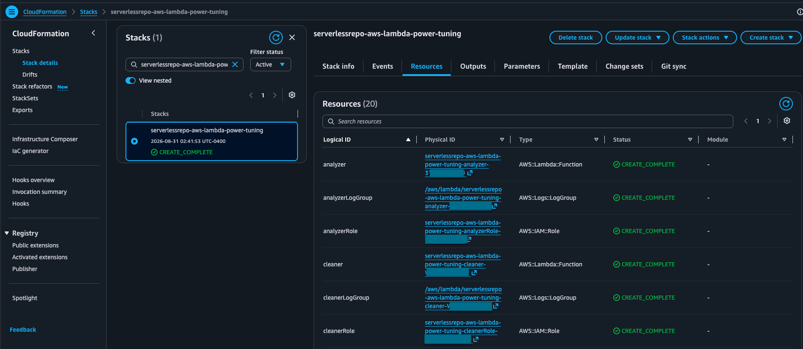

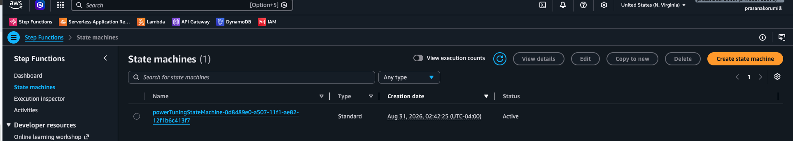

The state machine ran 10 invocations at each memory setting, with parallel invocation enabled and the `cost` strategy selected:

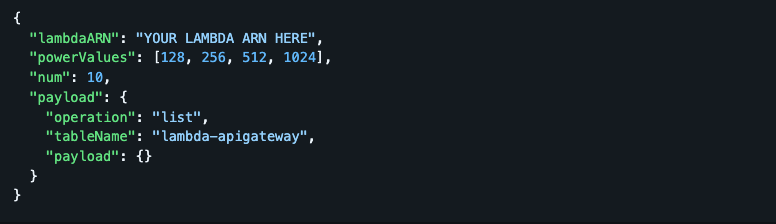

```json
{
  "lambdaARN": "<redacted>",
  "powerValues": [128, 256, 512, 1024],
  "num": 10,
  "payload": {
    "operation": "list",
    "tableName": "lambda-apigateway",
    "payload": {}
  },
  "parallelInvocation": true,
  "strategy": "cost"
}
```

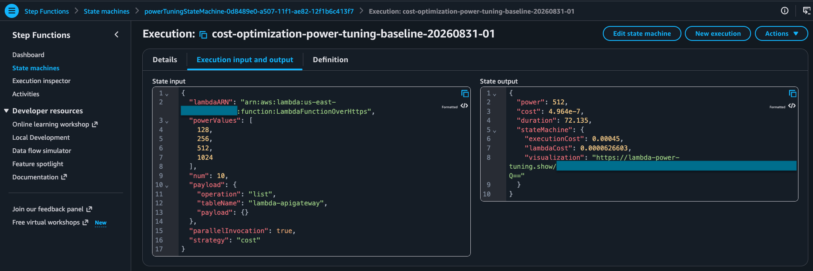


### 📊 Results & insights

| Memory (MB) | Invocation time | Cost impact | Notes |
| ---: | --- | --- | --- |
| 128 | High | Highest | Slowest and costliest |
| 256 | Moderate | Low | Improved, but suboptimal |
| 512 | Low | **Lowest** | **Optimal balance** |
| 1024 | Very low | Slightly higher | **Fastest performance** |

👉 **Decision guide:** Choose **512 MB** for the lowest estimated Lambda compute cost, or **1024 MB** for the lowest latency. This comparison covers Lambda compute only; total API cost also depends on the other services in the request path.

<a id="postman-load-tests"></a>
## 📈 End-to-end Postman load tests

Postman measured end-to-end response time for the API Gateway → Lambda → DynamoDB path using the same `POST` list request at each memory setting.

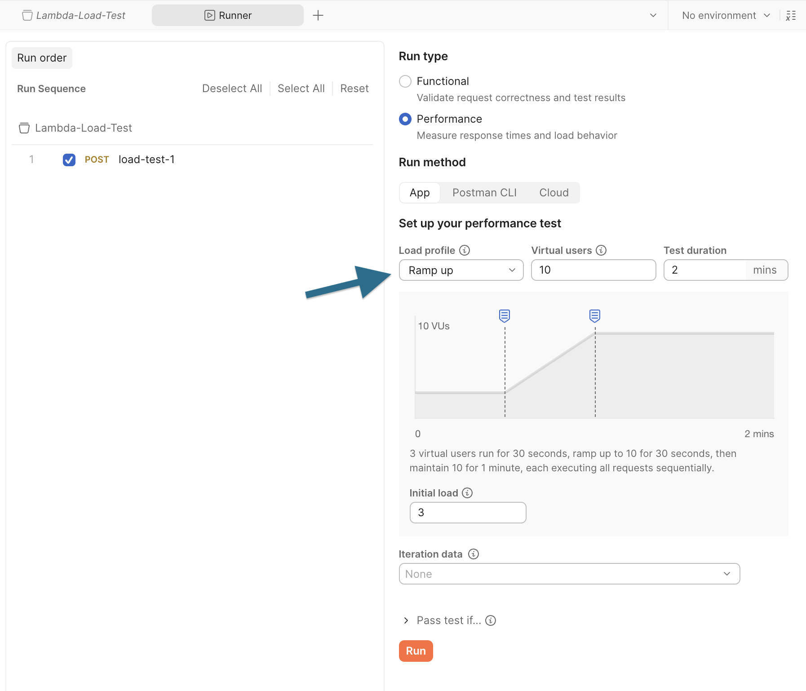

| Lambda memory | Total requests | Throughput | Average response time | Error rate | Latency change vs. 128 MB |
| ---: | ---: | ---: | ---: | ---: | ---: |
| 128 MB | 3,701 | 30.77 req/s | 231 ms | 0.00% | baseline |
| 512 MB | 7,015 | 58.32 req/s | 119 ms | 0.00% | **48.5% lower** |
| 1024 MB | 12,039 | 100.09 req/s | 67 ms | 0.00% | **71.0% lower** |

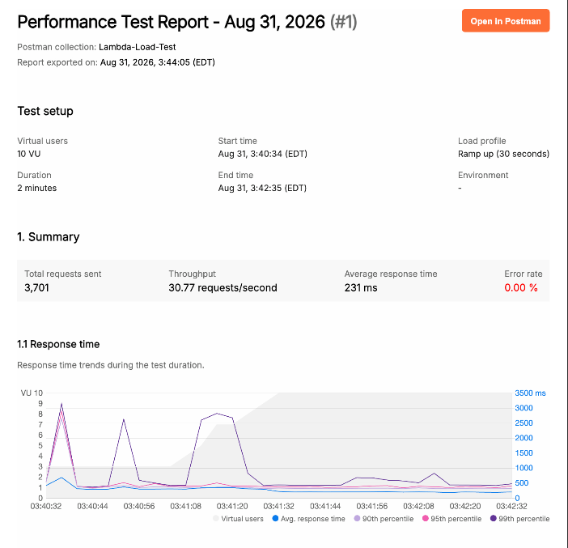

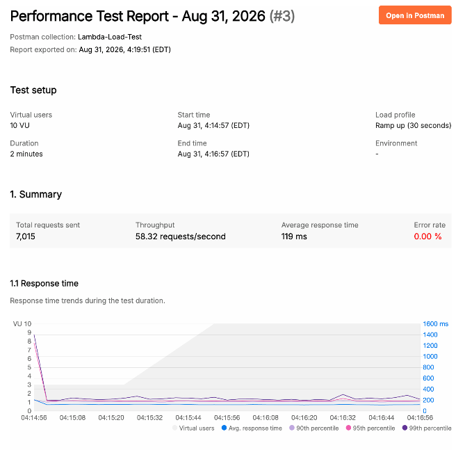

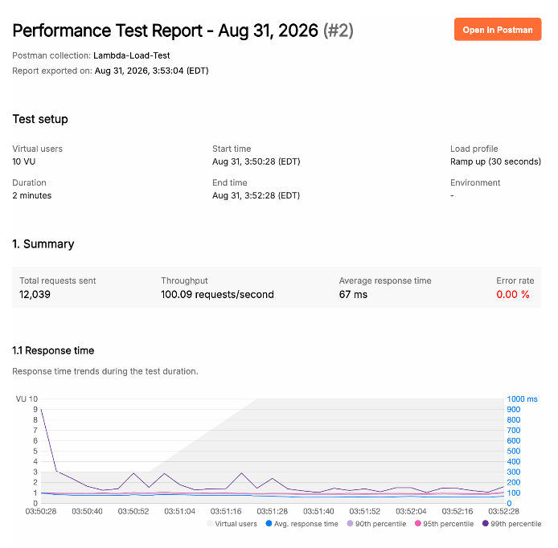

### Load-test validation

All runs completed with 0.00% errors and showed lower latency as memory increased. Each setting was measured once; repeat the test under identical conditions before making a production decision. Throughput is comparative for this fixed-user test, not a maximum-capacity figure.

<a id="recommendation"></a>
## 🎯 Recommendation

| Decision goal | Recommended Lambda memory | Evidence and trade-off |
| --- | ---: | --- |
| Minimize estimated Lambda compute cost while maintaining responsive API behavior | **512 MB** | Lowest-cost Power Tuning result; 119 ms average API response time; 0.00% errors |
| Minimize response time | **1024 MB** | Fastest direct-Lambda result; 67 ms average API response time; 0.00% errors, with slightly higher compute cost |

**Recommendation:** Start with **512 MB** for this workload. It delivers the lowest estimated Lambda compute cost while maintaining a responsive 119 ms average API response time. Choose **1024 MB** only when its additional 52 ms latency reduction justifies the higher invocation cost. Before production rollout, confirm the final setting with repeated tests and a full request-cost model.

<a id="cost-optimization-practices"></a>
## 💡 Cost-optimization practices demonstrated

- Automated, repeatable infrastructure with CloudFormation.
- On-demand DynamoDB for an intermittent workload.
- Least-privilege IAM scoped to one table and one log group.
- 14-day CloudWatch log retention to control logging storage costs.
- Resource tags for cost allocation and ownership.
- Measurement-based Lambda memory selection and periodic retesting.

<a id="references"></a>
## 📚 References

- [AWS Lambda Power Tuning](https://github.com/alexcasalboni/aws-lambda-power-tuning) — the open-source Step Functions tool used for the baseline.
- [AWS Lambda memory configuration](https://docs.aws.amazon.com/lambda/latest/dg/configuration-memory.html) — Lambda allocates CPU proportionally to configured memory.
- [Amazon DynamoDB on-demand capacity mode](https://docs.aws.amazon.com/amazondynamodb/latest/developerguide/on-demand-capacity-mode.html) — the pay-per-request billing model used by the table.
- [AWS Serverless Performance](https://github.com/prasanakorumilli/aws-serverless-performance) — a related reference implementation reviewed while organizing this project.
