# AWS Serverless Performance Optimization with Lambda Power Tuning

This portfolio lab applies the AWS Well-Architected **Cost Optimization** pillar to an API Gateway → Lambda → DynamoDB workload. It uses measured evidence—not a guessed memory size—to choose between a cost-optimized and a performance-optimized Lambda configuration.

**Result:** Lambda Power Tuning selected **512 MB** as the lowest estimated Lambda invocation-cost configuration. The same configuration completed the API load test with a **119 ms** average response time and no errors. **1024 MB** was the fastest option, with a **67 ms** end-to-end average response time, but it was not the lowest-cost configuration.

> These results apply to this code, payload, region, test conditions, and point in time. Re-run the measurements after material workload or architecture changes.

## Architecture

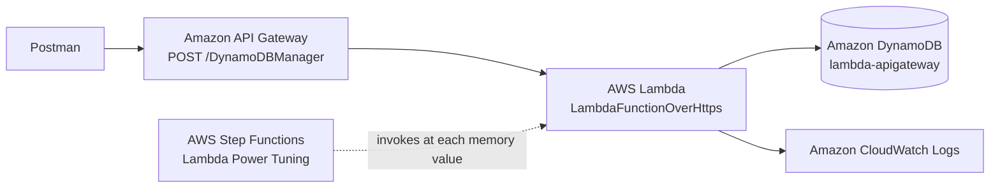

The Lambda application code was kept unchanged from the course lab. It supports `create`, `read`, `update`, `delete`, `list`, `echo`, and `ping` operations against DynamoDB. My enhancement is the automated foundation and the evidence-driven cost/performance analysis.

## What I automated with CloudFormation

[`infrastructure/foundation.yaml`](infrastructure/foundation.yaml) provisions the supporting resources while Lambda and API Gateway are configured manually for hands-on learning.

| Resource | Implementation |
| --- | --- |
| DynamoDB | Table `lambda-apigateway`, string partition key `id`, on-demand (`PAY_PER_REQUEST`) billing, and project/environment/management tags |
| IAM role | Named `lambda-apigateway-role` with the Lambda service trust policy |
| DynamoDB permissions | Inline, table-scoped permission for only the CRUD/list actions the lab code supports |
| CloudWatch Logs | Pre-created `/aws/lambda/LambdaFunctionOverHttps` log group with 14-day retention |
| Logging permissions | Inline permission for only `CreateLogStream` and `PutLogEvents` on the function log group |

The template deliberately avoids broad `dynamodb:*`, `logs:*`, and `Resource: "*"` permissions. It also has CloudFormation outputs for the table, role, and log group names/ARNs.

## Implementation walkthrough

### 1. Deploy the automated foundation

Create a CloudFormation stack from [`foundation.yaml`](infrastructure/foundation.yaml), acknowledge `CAPABILITY_NAMED_IAM`, and use the output role when creating the Lambda function.


The resource inventory confirms that the stack created the DynamoDB table, Lambda execution role, and CloudWatch log group.


The DynamoDB evidence shows the `id` string partition key and on-demand capacity mode defined in the template.

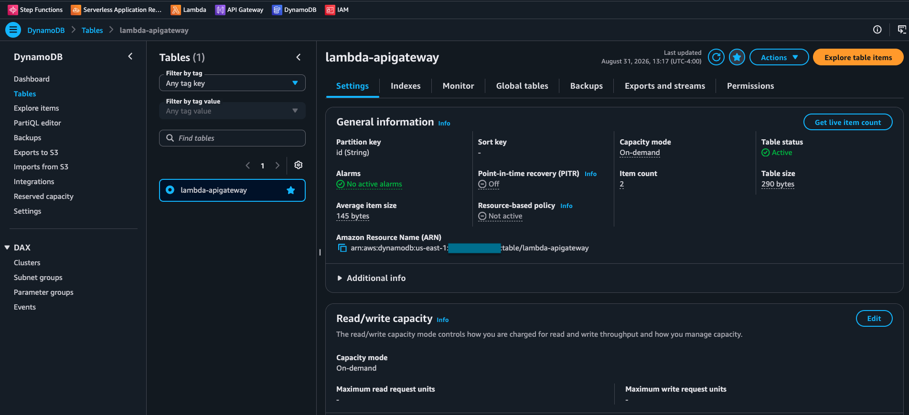

The named `lambda-apigateway-role` contains only the two inline policies created by the template: table access and function logging.

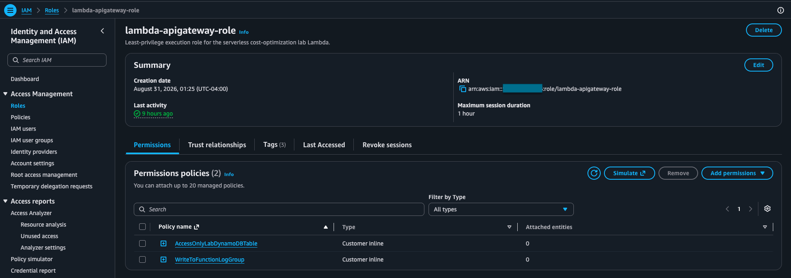

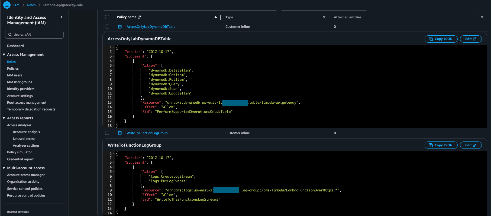

### 2. Deploy the Lambda and API Gateway integration

Create `LambdaFunctionOverHttps` with the execution role above. API Gateway exposes a `POST` method on `/DynamoDBManager` and invokes the Lambda. The API invoke URL is redacted in the evidence.

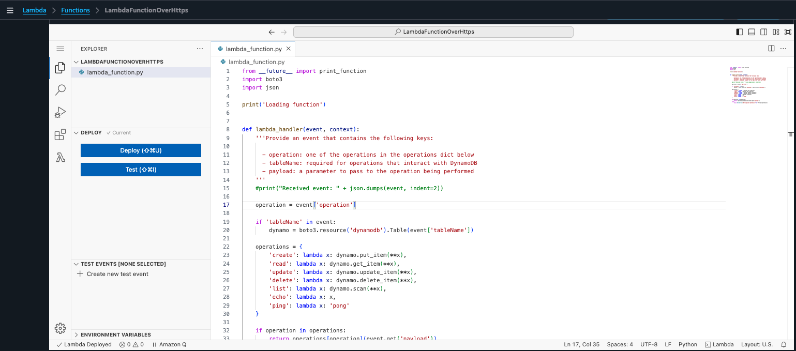

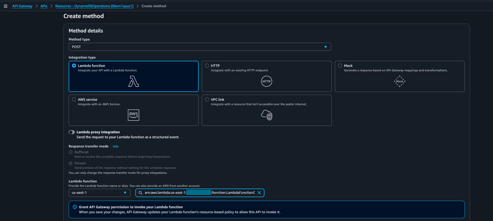

### 3. Verify the functional path before testing

I first validated the Lambda with an `echo` event, then used Postman to create and list DynamoDB records through API Gateway. This confirms the deployed request path before collecting performance data.

```json
{
  "operation": "create",
  "tableName": "lambda-apigateway",
  "payload": {
    "Item": {
      "id": "cost-opt-demo-001",
      "project": "aws-serverless-cost-optimization",
      "workload": "api-gateway-lambda-dynamodb",
      "testPhase": "functional-validation",
      "memoryMb": 128,
      "status": "created"
    }
  }
}
```

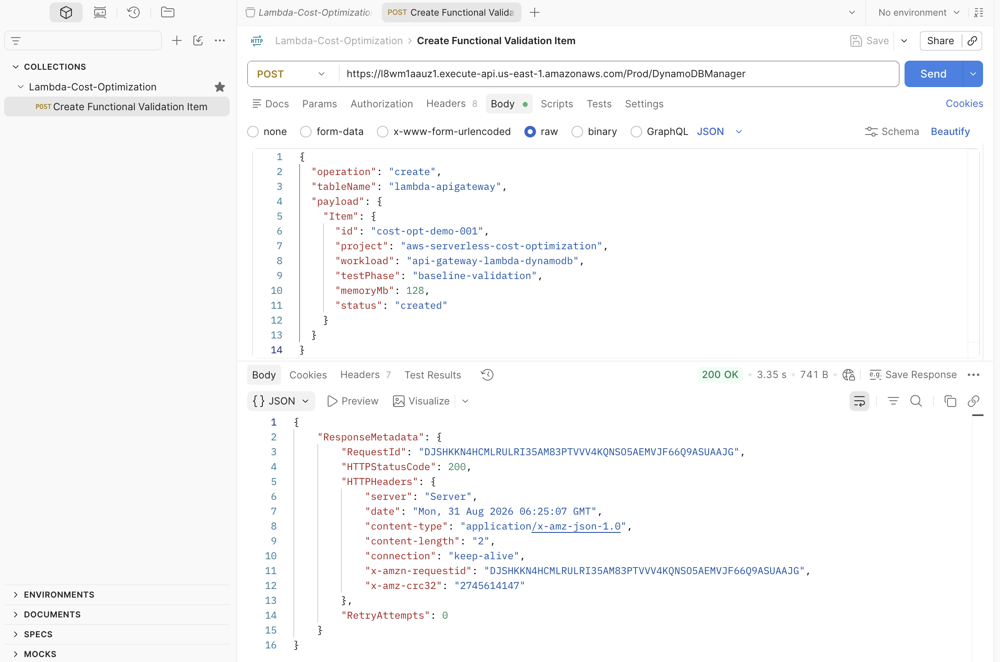


## Baseline: AWS Lambda Power Tuning

AWS Lambda Power Tuning is a Step Functions-based tool that invokes the same Lambda at multiple memory settings and compares its average duration and estimated Lambda invocation cost. This baseline is a **direct Lambda measurement**; it does not include API Gateway latency.

The state machine ran 10 invocations at each memory setting, with parallel invocation enabled and the `cost` strategy selected:

```json
{
  "lambdaARN": "<redacted>",
  "powerValues": [128, 256, 512, 1024],
  "num": 10,
  "payload": {
    "operation": "list",
    "tableName": "lambda-apigateway",
    "payload": {}
  },
  "parallelInvocation": true,
  "strategy": "cost"
}
```


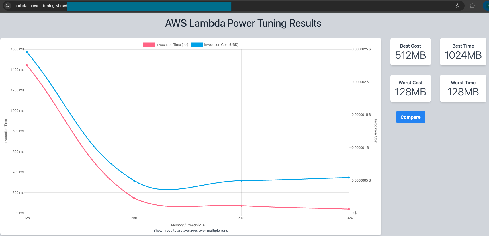

### Baseline validation and interpretation

| Finding | Evidence | Interpretation |
| --- | --- | --- |
| **Best cost: 512 MB** | State-machine output: `power: 512`, `cost: 4.964e-7`, `duration: 72.135 ms` | 512 MB is the minimum estimated Lambda compute-cost choice for this `list` payload. |
| **Best time: 1024 MB** | Power Tuning visualization | 1024 MB has the lowest direct Lambda duration, roughly 35 ms in the graph. |
| **Worst cost and time: 128 MB** | Power Tuning visualization | The smallest allocation took about 1.45 seconds and was also the most expensive per direct invocation for this workload. |
| **Practical knee of the curve: 512 MB** | Time falls sharply from 128 → 256 → 512 MB, while cost reaches its minimum at 512 MB | More memory also provides more CPU. For this workload, the faster execution offsets the higher GB-second rate. |

This is a valid cost-optimization baseline for **Lambda compute**. It does not prove that 512 MB minimizes the whole API request cost, which would also include API Gateway, DynamoDB, CloudWatch Logs, and data transfer.

## End-to-end Postman load tests

The separate Postman performance test measures the deployed request path: API Gateway → Lambda → DynamoDB. All runs used the same `POST` list request and a two-minute ramp-up profile: three virtual users for the first 30 seconds, ramp to ten over the next 30 seconds, then maintain ten virtual users for one minute.


| Lambda memory | Total requests | Throughput | Average response time | Error rate | Latency change vs. 128 MB |
| ---: | ---: | ---: | ---: | ---: | ---: |
| 128 MB | 3,701 | 30.77 req/s | 231 ms | 0.00% | baseline |
| 512 MB | 7,015 | 58.32 req/s | 119 ms | 0.00% | **48.5% lower** |
| 1024 MB | 12,039 | 100.09 req/s | 67 ms | 0.00% | **71.0% lower** |

### 128 MB baseline

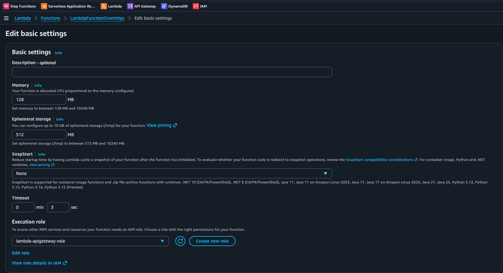


At 128 MB, the test had no errors but the highest average response time (231 ms) and lowest observed throughput (30.77 req/s). The long response-time spikes make it a poor choice for this workload.

### 1024 MB performance result

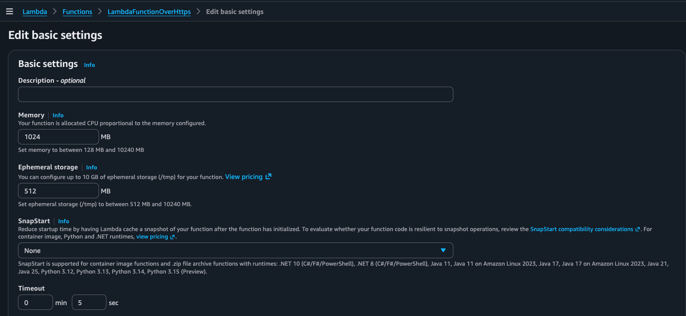


At 1024 MB, average response time fell to 67 ms—3.45× faster than 128 MB—and observed throughput rose to 100.09 req/s. This agrees with Power Tuning's **Best Time** result.

### 512 MB cost-optimized result

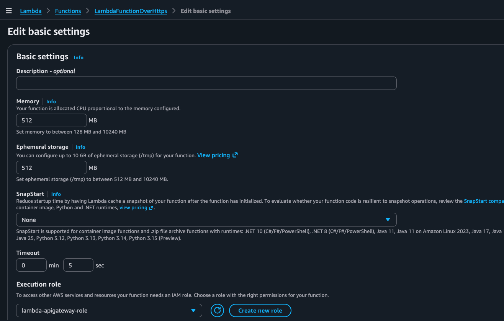


At 512 MB, average response time was 119 ms—48.5% lower than 128 MB—with 58.32 req/s and no errors. This supports 512 MB as a strong cost-optimized production candidate when 119 ms meets the application latency objective.

### Load-test validation

The results consistently improve as memory increases, and all three runs returned 0.00% errors. The measurements support the direction and the trade-off, with two important limitations to disclose in an interview or production decision:

- Each memory level was measured once, sequentially. Repeat and randomize the runs to quantify normal variation, cold starts, and DynamoDB/cache effects.
- The 128 MB screenshot shows a 3-second Lambda timeout, while the 512 MB and 1024 MB screenshots show 5 seconds. No errors were recorded, so the timeout did not drive the reported averages; nevertheless, use the same timeout in a strict repeatable comparison.

The throughput figures are from a fixed-virtual-user, closed-loop test. Faster responses allow the virtual users to send their next request earlier, so they are useful comparative results—not a claim of the API's maximum sustainable capacity.

## Recommendation

| Goal | Recommended memory | Reason |
| --- | ---: | --- |
| Minimize estimated Lambda compute cost while maintaining responsive API behavior | **512 MB** | Power Tuning's lowest-cost result; 119 ms average API response; zero errors |
| Minimize response time | **1024 MB** | Power Tuning's fastest direct-Lambda result; 67 ms average API response; zero errors |

For this lab, I would deploy **512 MB** as the default if its 119 ms average satisfies the service-level objective. I would choose **1024 MB** when the 52 ms additional latency reduction is worth the small increase in estimated Lambda invocation cost. The final production choice should include a full cost model and repeated load tests.

## Cost-optimization practices demonstrated

- Automated, repeatable infrastructure with CloudFormation.
- On-demand DynamoDB for an intermittent lab workload.
- Least-privilege IAM scoped to one table and one log group.
- 14-day CloudWatch log retention to control logging storage costs.
- Resource tags for cost allocation and ownership.
- Measurement-based Lambda memory selection and periodic retesting.

## References

- [AWS Lambda Power Tuning](https://github.com/alexcasalboni/aws-lambda-power-tuning) — the open-source Step Functions tool used for the baseline.
- [AWS Lambda memory configuration](https://docs.aws.amazon.com/lambda/latest/dg/configuration-memory.html) — Lambda allocates CPU proportionally to configured memory.
- [Amazon DynamoDB on-demand capacity mode](https://docs.aws.amazon.com/amazondynamodb/latest/developerguide/on-demand-capacity-mode.html)
